# ByCell - Ürün Katalog Projesi</center>
<p> Bu proje Patika-Sodexo .NET Core Bootcamp bitirme projesidir. 
</p>
 
## Kullanılan Teknolojiler
- C#                    
- ASP .NET CORE Web Api
- MSSQL
- Entity FrameWork Core
- AutoMapper
- Fluent Validation
- Autofac
- Hangfire
- JWT

## Kurulum
1. İhtiyaçlar
    - Projeyi github'dan kendi bilgisayarınza yükleyiniz.
        ```
        git clone https://github.com/160-Sodexo-NET-Bootcamp/bitirmeprojesi-codearct.git
        ```
    - Redis
        - [Redis](https://github.com/microsoftarchive/redis/releases) msi paketini indiriniz.Paketi indirdikten sonra kurulumu yapınız.
            Terminal üzerinden 
            ``` 
            redis-server 
            ```
            komutuyla redisi çalıştırın.
        - Docker üzerinden redis kurulumu için : 
            ```
            docker run --name my-redis -p 6379:6379 -d redis
            ```
            terminalde çalıştırarak yükleme işlemini yapınız.
            ```
            docker ps
            ```
            komutu ile redis-server çalışma durumunu kontrol edebilirsiniz.
2. Çalıştır
    - İlgili dizine giderek
        ```
        Your path\ByCell\WebAPI 
        ```
        Terminal üzerinden
        ```
        dotnet watch run
        ```
        komutuyla ana projemiz olan Web Api projemizi ayağa kaldıralım.Proje
        ```
        http://localhost:1923/
        ```
        portunda ayağa kalkacak.
    - Arka plan işlemleri için Hangfire
        ```
        Your Path\ByCell\BackgroundServicesAPI
        ```
        dizinine gidilerek.Terminalden
        ```
        dotnet watch run
        ```
        komutuyla ayağa kaldırılır.Hangfire
        ```
        http://localhost:1922/bycellhangfire
        ```
        port ve uç noktasında ayağa kalkacaktır.


## Proje Katmanları 
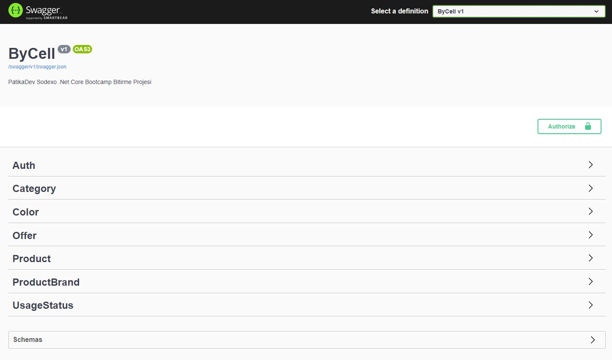
- Proje 3 temel ve 4 yardımcı katman olmak üzere 7 katmandan oluşmaktadır.
    1. Üye kayıt ve giriş katmanı
    2. Ürün katmanı
        - Kategori,renk,marka ve kullanım durumu katmanları ürün oluştururken kullandığımız yardımcı katmanlardır.
    3. Teklif katmanı

## Üye Kayıt/Giriş İşlemleri
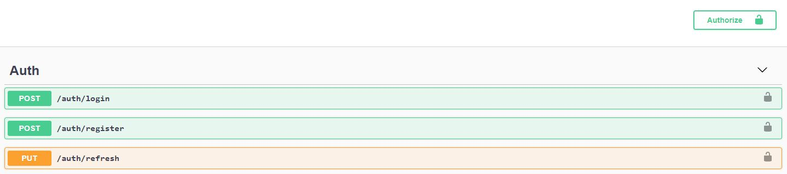
1. Kullanıcı kayıt işlemleri
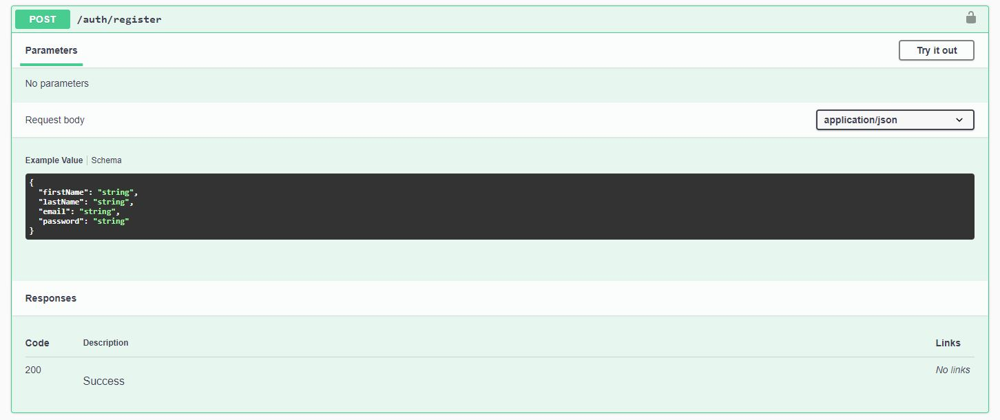
    - Kullanıcılar sisteme üye olabilirler.
        - Ad ve soyad alanı boş bırakılamaz.
        - Email valid olmalı.
        - Şifre en az 8 en fazla 20 karakter uzunluğunda olmalı.
    - Validasyonlar geçilirse kullanıcıya başarılı bir mesaj dönülür.
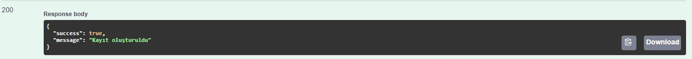
    - "Hoşgeldiniz" maili gönderilir.
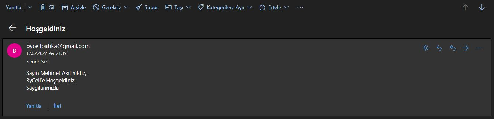
    - Validasyonlar geçilemezse validasyona bağlı olarak kullanıcıya hata mesajı dönülür.
    - Kullanıcı şifreleri veritabanında hashing ve aynı şifreye sahip kullanıcılar için salting uygulanarak gizlenmiş olarak tutulur.
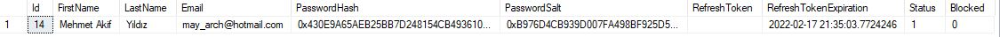
2. Kullanıcı Giriş İşlemleri
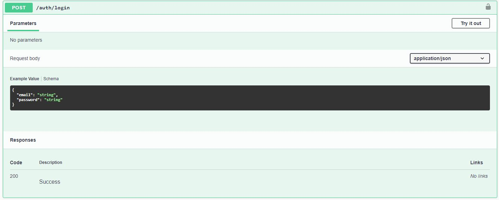
    - Kullanıcılar sisteme giriş yapabilirler.
        - Email boş olamaz ve valid olmalı.
        - Şifre boş olamaz; en az 8 en fazla 20 karakter uzunluğunda olmalı.
    -Giriş işlemi başarılı ise token ve refresh token üretilir.
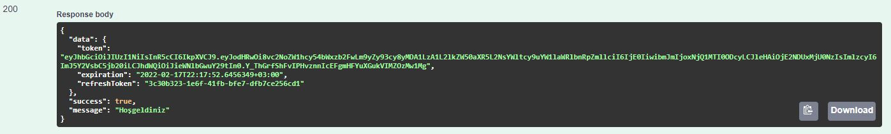
    - Swagger Authorize sekmesi üzerinden tüm kimlik doğrulama gerektiren isteklerde Header'a Bearer token eklenir.
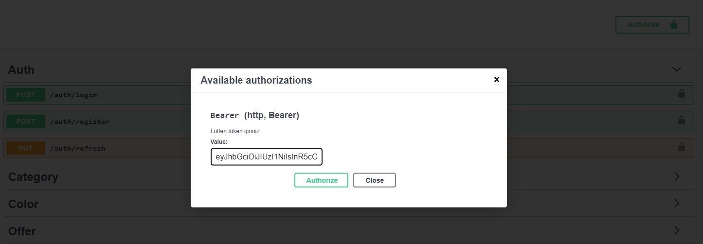
    - Belirli bir süre sonra geçersiz olan token için kullanıcıya verilen refresh token ile yeni bir token üretilir.Üretilen bu token ile kullanıcı işlemlerine devam edebilir.
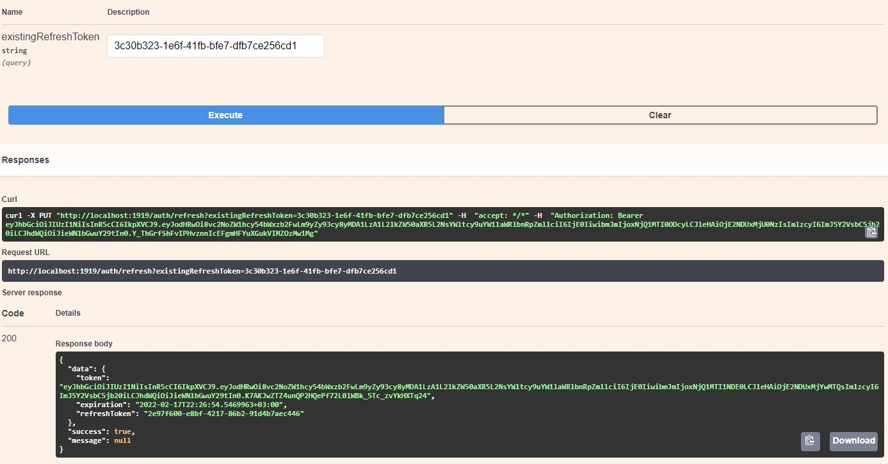
    - Şifrenin 3 kez yanlış girilmesi durumunda hesap bloke edilir.
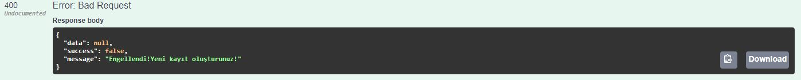
    - Kullanıcıya bilgilendirme maili atılır.
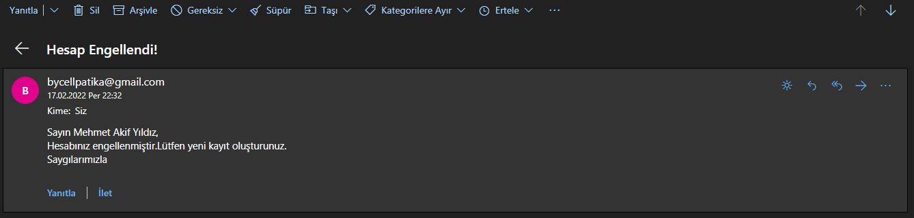

## Ürün İşlemleri
1. Ürün Ekleme
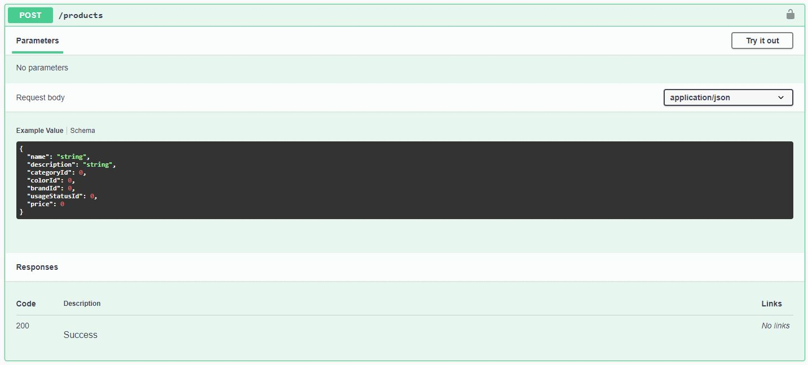
    - Kullanıcı ürün eklemek için kayıt olmalı ve giriş yapmalıdır.
    - Ürün adı alanı doldurulması zorunlu bir alandır.En fazla 100 karakter uzunluğunda olmalı.
    - Açıklama alanı doldurulması zorunlu bir alandır.En fazla 500 karakter uzunluğunda olmalı.
    - Kategori katmanından kategoriler listelenmeli ve en fazla bir kategori seçilmelidir.
    - Renk katmanından renkler listelenmeli ve en fazla bir renk seçilmelidir.Bu alan kullanıcı için doldurulması zorunlu bir alan değildir.
    - Marka katmanından markalar listelenmeli ve en fazla bir marka seçilmelidir.Bu alan kullanıcı için doldurulması zorunlu bir alan değildir.
    - Kullanım durumu katmanından kullanum durumları listelenmeli ve en fazla bir kullanım durumu seçilmelidir.Bu alan kullanıcı için doldurulması zorunlu bir alandır.
    - Fiyat alanı sayı olarak doldurulması zorunlu bir alandır.
    - Kullanıcı ürün için aradığı kategori,renk,marka,kullanım durumunu ilgili katmanlarda bulamadığında kendisi ekleyebilir. 
2. Ürün Resmi Ekleme
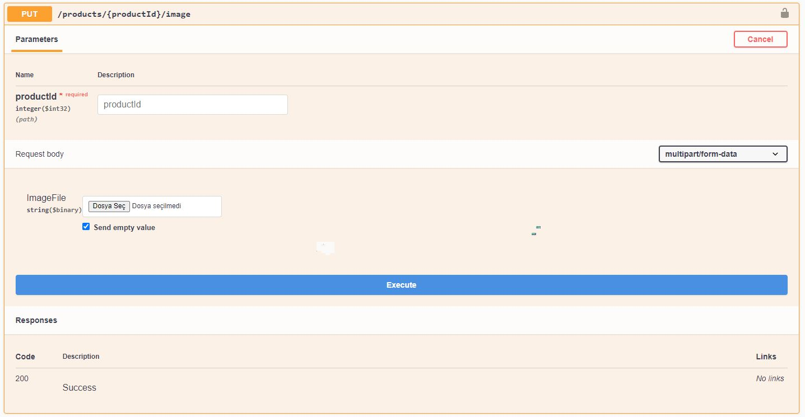
    - Kullanıcı ürün ekleme işlemini tamamladıktan sonra ilgili ürün için resim ekleyebilir.
3. Diğer Ürün İşlemleri
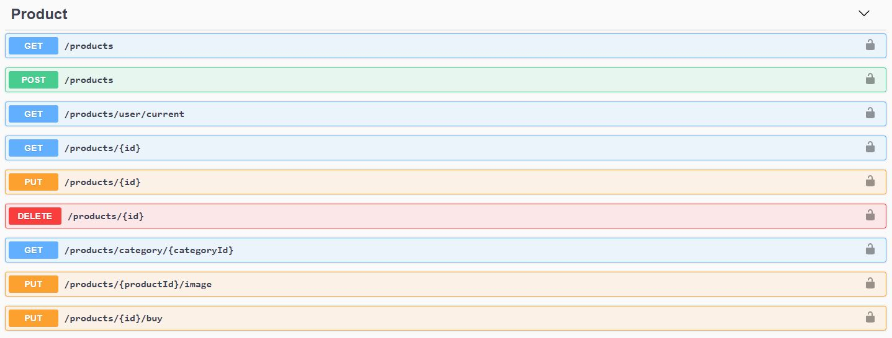
    - Kullanıcılar giriş yapmadan tüm ürünleri listeyebilirler.
    - Kullanıcılar giriş yapmadan istedikleri ürünün detaylarına ulaşabilirler.
    - Kullanıcılar giriş yaptıktan sonra kendi ürünlerine ulaşabilirler.
    - Kullanıcılar giriş yaptıktan sonra sadece kendilerine ait ürünlerde değişiklik yapabilir veya silebilirler.
    - Kullanıcılar giriş yaptıktan sonra kendilerine ait olmayan diğer ürünleri satın alabilirler.
## Teklif İşlemleri
1. Teklif Ver
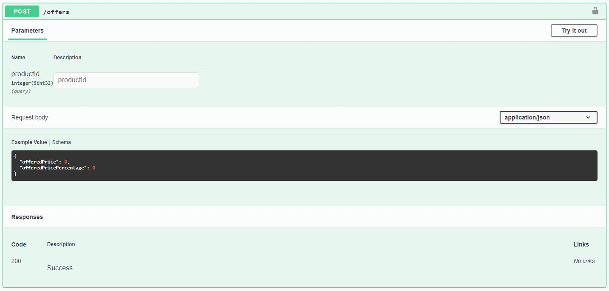
    - Kullanıcının teklif verebilmesi için giriş yapmalıdır.
    - Üründen gelen teklife açık olma durumuna göre kullanıcılar ürünlere teklif verebilirler.
    - Teklif verme ya direk fiyat girerek olmalı ya da ürün fiyatı üzerinden yüzdelik teklif verilmeli.(100 TL olan bir ürün için 40 girilirse 40 TL teklif yapılmış olunur.)
2. Diğer Teklif İşlemleri
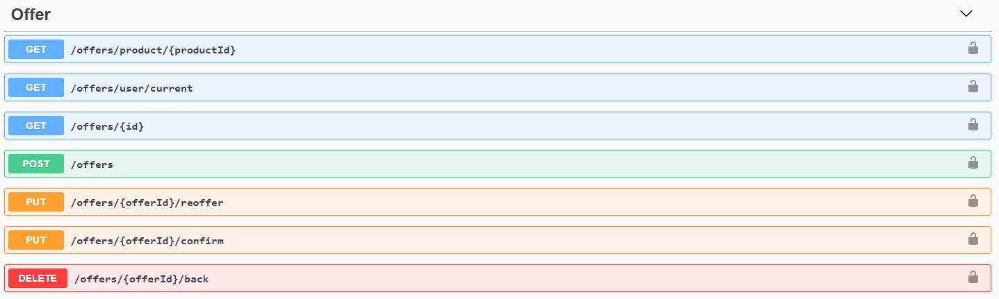
    - Kullanıcılar giriş yaptıktan sonra verdikleri teklifleri listeleyebilirler.
    - Kullanıcılar giriş yaptıktan sonra kendi ürünlerine gelen teklifleri ürün bazlı listeleyebilirler.
    - Teklif gelen ilgili ürün sahibi teklifi onaylayabilir ya da reddebilir.
    - Onaylanan teklifler satın alınmış olarak güncellenir.
    - Teklifler ilgili kullanıcılar tarafından güncellenip tekrar tekrif verilebilir veya teklif geri çekilebilir. 
## Email Servisi
- Email servisi bir arka plan işi olarak Hangfire üzerinden yapılmaktadır.
- İki email gönderimi vardır.
    1. Kullanıcı giriş yaptığında "Hoşgeldiniz" maili göndermek.
    2. Kullanıcı 3 kez şifresini yanlış girdiğinde hesabının bloke olduğuna dair bilgilendirme maili göndermek.
- Emailler veritabanında bir kuyrukta toplanır.
- 2 saniyede bir tekrar eden iş olarak çalışan ve durumu "Beklemede" olan ilk 10 mail Hangfire tarafından veritabanından çekilerek gönderilir.
- Başarıyla gönderilen maillerin durumu "Gönderildi" olarak güncellenir.
- Gönderimi başarısız olan mailler 5 kez tekrar denendikten sonra durumu "Başarısız" olarak güncellenir ve kuyruktan çıkarılır.
- Kullanıcının şifresini 3 kez yanlış girme  ve gönderimi başarısız olan maillerin tekrar denenme sayısı "Redis" üzerinden tutulur.
